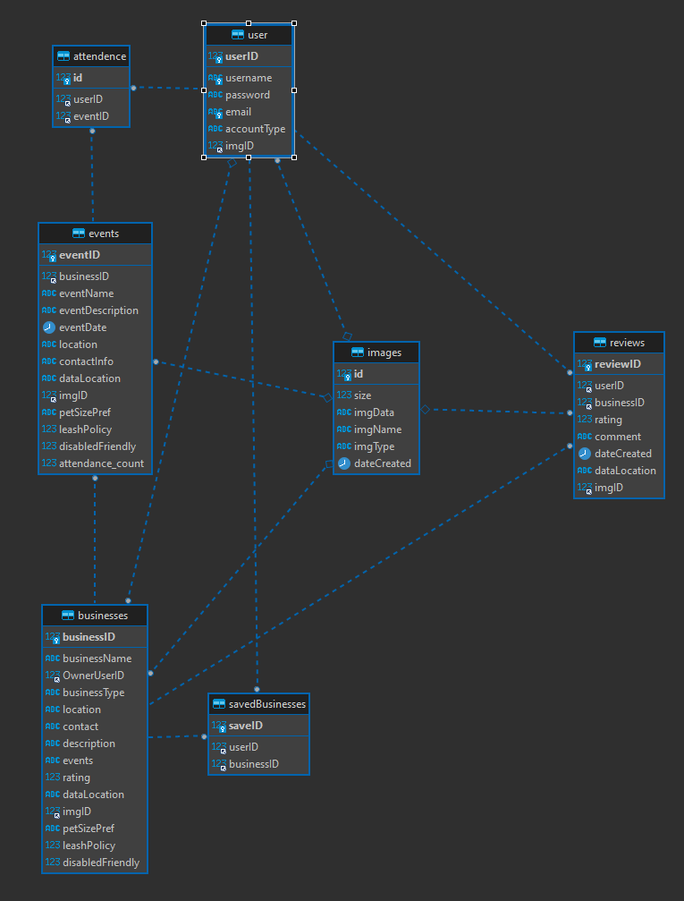

# Woof
## Because Pets are Family Too

## About Us
- Bo Nappie:
    - contributions: frontend, designs
- Giovanny Joseph:
    - contributions: backend, frontend, project management
- Martin Genao:
    - contributions: backend, map asset
## Inspiration
Society is enduring a cultural shift; the bond between pets and their owners has never been stronger, with most pet owners considering their pets to be a member of the family. Woof helps pet owners by making it easy to find pet friendly businesses, travel accommodations, and events.

## Features
+ Regular User
    + Search Businesses
        + Leave review on business
        + Save Business
    + Search Events
        + Attend event
    + Update Profile
        + Change properties of account
        + Delete account
+ Business User
    + Regular User Privileges
    + Create Business
+ Registered Business User
    + Regular User Privileges
    + Create Events
    + Update Events
        + Change properties
        + Delete Event
    + Update Business
        + Change properties
        + Delete Business

## Design Choices
### Session manager 
+ Global object used to keep track of user variables
### Location manager
+ Global object used to get users current location
### View/View Model Architecture
+ Views used to present data 
+ View Models used to manipulate data
### Assets
+ Reusable assets that can be called upon on any page and generated procedurally
### API
+ Custom API connected to personal database used for CRUD operations

## Diagrams
- Woof Pages
    -  
    

- ER Diagram 
    - 

- Data Management Pipeline
    - 
- 3rd Party API pipeline
    - 

## Backend
### Woof API
Our System is Powered By our internal API called WoofAPI
[Click Here To Read More](API/layout.md)
### Yelp API Scrapper
We keep up to date data from Yelp using out Yelp API Scrapper [Click Here To Read More](3rdParty_API/layout.md)
