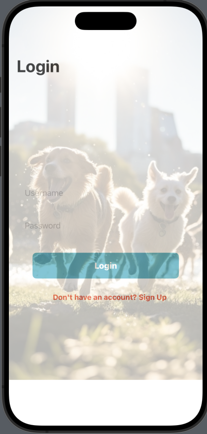
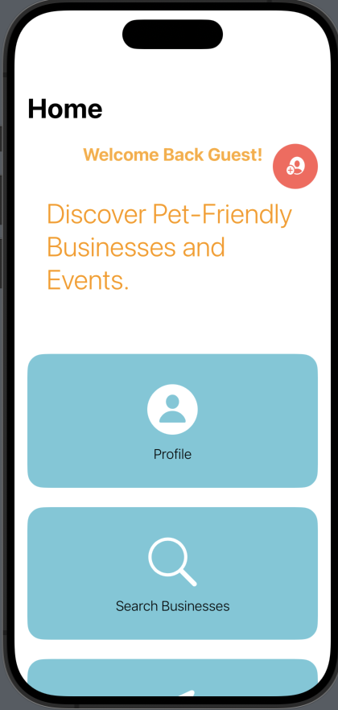
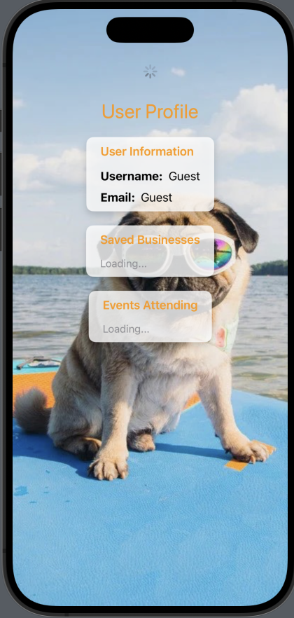
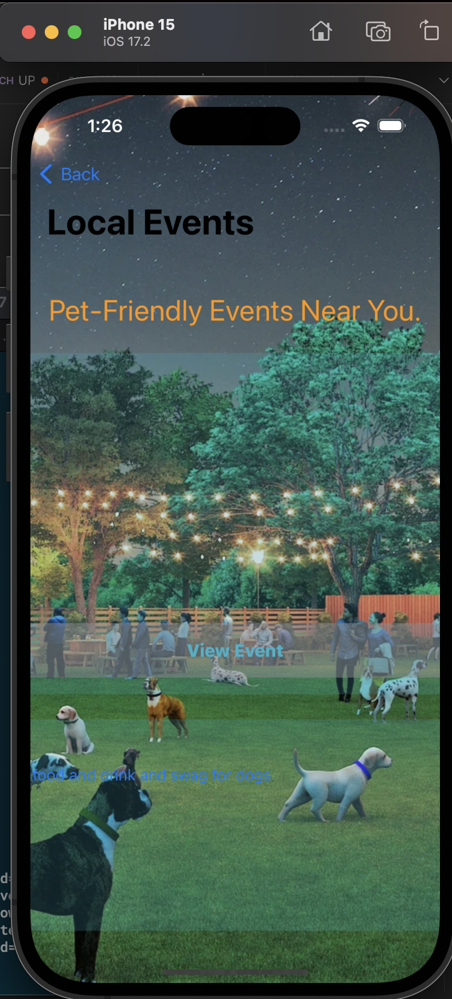
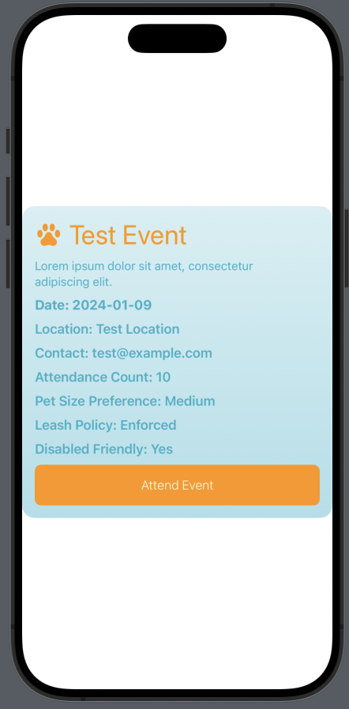
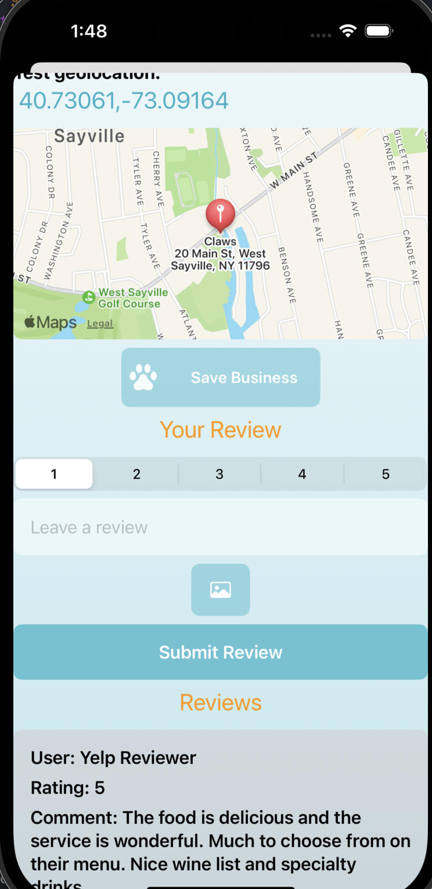
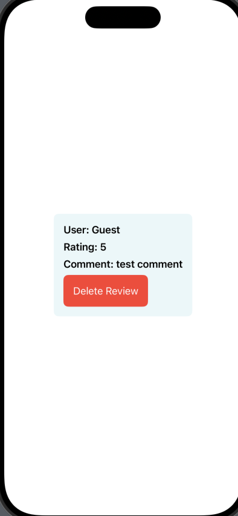

# Pages To Fix

## LoginView
- fix overlay

## HomeView
- switch location of profile to be at top right corner

## ProfileView
- add update profile button to top right corner
- make buttons for:
    - owned business
    - saved business
    - events attending

## LocalEventsView -> LocalEventsMapView
- fix overlay (maybe event card is broken)
- add button somewhere (top right or maybe before event cards) to goto LocalEventsMapView())

## EventFullContextView
- make the layout fill the screen more

## BusinessFullContextView
- left align "your review"
- left align "Reviews"
- make map smaller
- add title to img picker

## ReviewCard (Asset)
- conditionally add the "delete review" button if user owns business (?)

